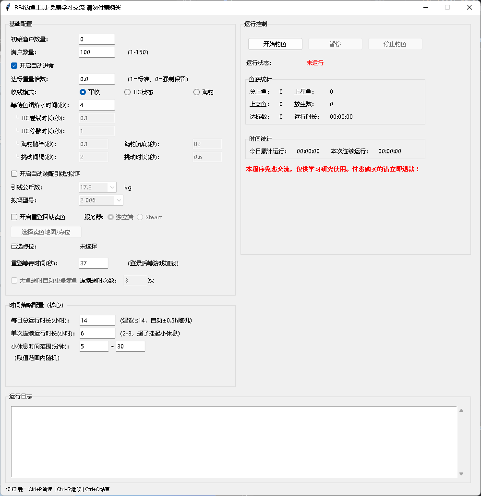

<div align="center">

# 俄罗斯钓鱼4全自动钓鱼脚本

</div>




#### 创建环境

```bash
python -m venv .venv
.venv\Scripts\activate
python.exe -m pip install --upgrade pip
pip install -r requirements.txt
```

## 许可证

本项目源代码采用 MIT 许可证（非商业使用），仅供学习与技术交流使用。  
禁止用于任何形式的商业行为，包括但不限于出售、收费脚本或嵌入付费服务。  
如需商业授权，请联系作者获得书面许可。  
详见项目[LICENSE](LICENSE) 文件。